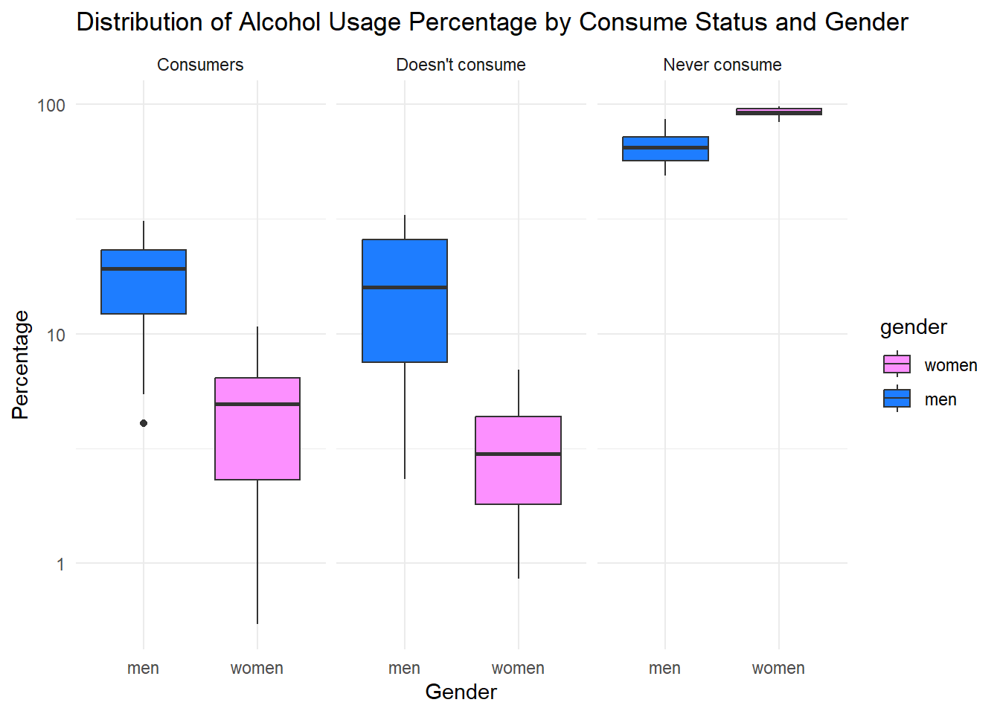
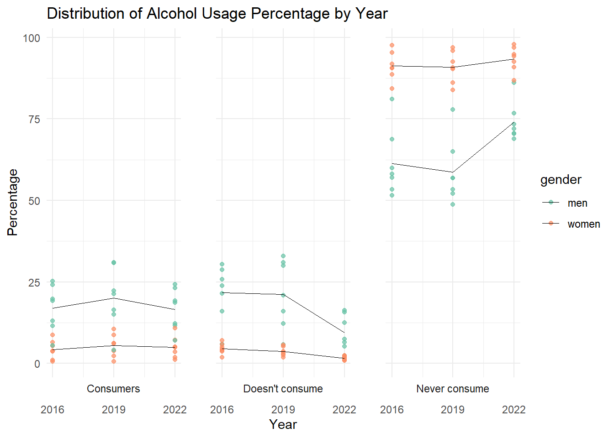
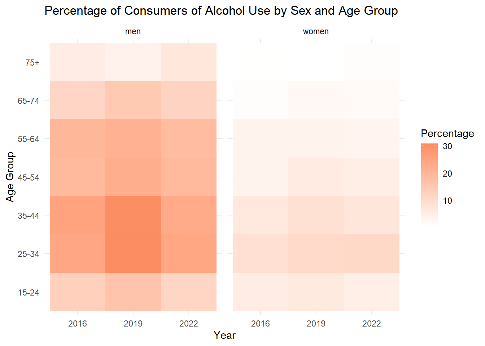

# Full Analysis

## Dataset 1 : The Percentage of Main Diseases/Health Problems Declared by Individuals in the Last 12 Months by Sex, 2016-2022 {toc-text="Dataset 1"}


::: {.cell}

:::


### Average Percentage by Disease with Gender Connection {toc-text="Plot 1"}


::: {.cell}

```{.r .cell-code  code-fold="true" code-summary="Show the code"}
abbreviate_disease_names <- abbreviate(data_1_longer$Diseases)
ggplot(data_1_longer, aes(x = Diseases, y = Percentage, fill = Gender)) +
  geom_bar(stat = "summary", fun = "mean", position = "dodge", width = 0.7) +
  labs(title = "Average Percentage by Disease with Gender Connection",
       x = "Diseases",
       y = "Percentage") +
  scale_x_discrete(labels = abbreviate_disease_names) +
  scale_y_continuous(breaks = seq(0, 30, by = 5)) +
  scale_fill_manual(values = c("#99C2FF", "#FFB6C1")) +
  theme_minimal() +
  theme(axis.text.x = element_text(angle = 45, hjust = 1))
```

::: {.cell-output-display}
{width=672}
:::
:::


### Percentage by Disease with Year Connection {toc-text="Plot 2"}


::: {.cell}

```{.r .cell-code  code-fold="true" code-summary="Show the code"}
abbreviate_disease_names <- abbreviate(data_1_longer$Diseases)

custom_colors <- c("#66c2a5", "#fc8d62", "#8da0cb")

ggplot(data_1_longer, aes(x = Diseases, y = Percentage, fill = as.factor(Year))) +
  geom_bar(stat = "identity", position = "dodge", width = 0.7) +
  labs(title = "Percentage by Disease with Year Connection",
       x = "Diseases",
       y = "Percentage",
       fill = "Year") +
  scale_x_discrete(labels = abbreviate_disease_names) +
  scale_y_continuous(breaks = seq(0, 35, by = 5)) +
  scale_fill_manual(values = custom_colors) +
  theme_minimal() +
  theme(axis.text.x = element_text(angle = 45, hjust = 1))
```

::: {.cell-output-display}
{width=672}
:::
:::


## Data Set 2 : The Percentage of Individuals’ Status of Alcohol Use by Sex and Age Group, 2016-2022 {toc-text="Dataset 2"}

## Data Set 3 : Body Mass Index Distribution of Individuals by Sex, 2008-2022 {toc-text="Dataset 3"}


::: {.cell}

:::


### Percentage of Categories Over Years {toc-text="Plot 1"}


::: {.cell}

```{.r .cell-code  code-fold="true" code-summary="Show the code"}
ggplot(data_3_long, aes(x = Year, y = Percentage, fill = Category)) +
  geom_bar(stat = "identity", position = "dodge") +
  labs(title = "Percentage of Categories Over Years",
       x = "Year",
       y = "Percentage") +
  theme_minimal()
```

::: {.cell-output-display}
{width=672}
:::
:::


### Percentage Trends Over Years {toc-text="Plot 2"}


::: {.cell}

```{.r .cell-code  code-fold="true" code-summary="Show the code"}
ggplot(data_3_long, aes(x = Year, y = Percentage, color = Category)) +
  geom_line() +
  labs(title = "Percentage Trends Over Years",
       x = "Year",
       y = "Percentage") +
  theme_minimal()
```

::: {.cell-output-display}
{width=672}
:::
:::


### Composition of Categories Over Years {toc-text="Plot 3"}


::: {.cell}

```{.r .cell-code  code-fold="true" code-summary="Show the code"}
ggplot(data_3_long, aes(x = Year, y = Percentage, fill = Category)) +
  geom_area() +
  labs(title = "Composition of Categories Over Years",
       x = "Year",
       y = "Percentage") +
  theme_minimal()
```

::: {.cell-output-display}
{width=672}
:::
:::


### Percentage of Categories by Gender {toc-text="Plot 4"}


::: {.cell}

```{.r .cell-code  code-fold="true" code-summary="Show the code"}
ggplot(data_3_long, aes(x = Sex, y = Percentage, fill = Category)) +
  geom_bar(stat = "identity", position = "dodge") +
  labs(title = "Percentage of Categories by Gender",
       x = "Gender",
       y = "Percentage") +
  theme_minimal()
```

::: {.cell-output-display}
{width=672}
:::
:::

